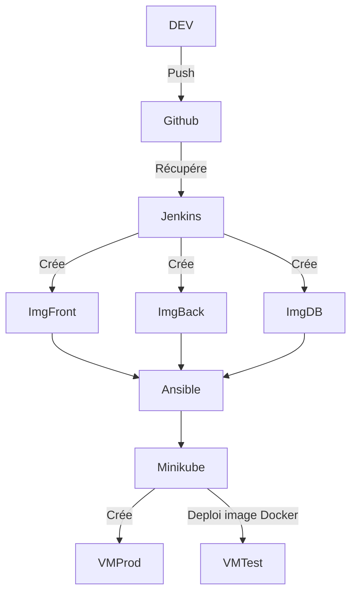

# ProjetDEVOPS

- Minikube : Julien
- Ansible : Agathe
- Jenkins : Lucas
- Grafana/Loki : corentin

## shcema projet

```mermaid
graph TD;
DEV--> |Push|Github;
Github--> |Récupére|Jenkins;
Jenkins--> |Crée|ImgFront-->Ansible;
Jenkins--> |Crée|ImgBack-->Ansible;
Jenkins--> |Crée|ImgDB-->Ansible;
Ansible--> Minikube--> |Crée|VMProd;
Minikube--> |Deploi image Docker|VMTest;
```
